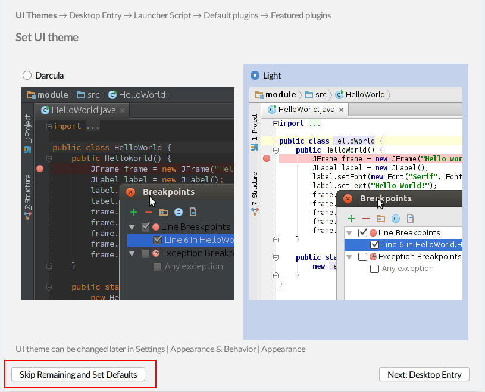

[](https://travis-ci.org/jansorg/pycharm-webinar-base)

# PyCharm Webinar 2019
Welcome to the PyCharm webinar!

This is the base setup used in Webinar. For details about the webinar see [the PyCharm blog](https://blog.jetbrains.com/pycharm/2018/12/webinar-live-development-of-a-pycharm-plugin-with-joachim-ansorg/).

## Setup your IDE
1. Clone this repository:
   ```bash
   git clone https://github.com/jansorg/pycharm-webinar-base.git
   ```
1. Install IntelliJ 2018.3.3 (Community or Ultimate). 

   Download it from [JetBrains](https://www.jetbrains.com/idea/). Feel free to use the Toolbox app, if you prefer that.
    
   In the following steps we assume that you downloaded 2018.3.3. 
   If you didn't, then make sure that you choose the right versions of the Python plugins.
1. Start the IDE. Make sure that the DevKit plugin is enabled, we'll need it!
   If it's the first statup, then it'll look like this. Choosing 'Skip Remaining and Set Defaults' is fine. 
    
1. Open the cloned directory on disk as a project.
1. Setup your IntelliJ SDK
1. Now you have to download the Python plugin to properly setup you project's SDK. 

   The PyCharm package can't be used as an SDK because it's not coming with the plugin development tooling we need.
   
   Download the PyCharm plugin which matches your edition of IntelliJ. Choose the download which is compatible with 2018.3.3. 
   - Plugin for IntelliJ Community: https://plugins.jetbrains.com/plugin/7322-python-community-edition
     
   - Plugin for IntelliJ Ultimate: https://plugins.jetbrains.com/plugin/631-python
      
1. Add the PyCharm plugin to the SDK
1. Run the plugin to test your environment

## General notes

### Directory structure
- `src/main/java`: Java sources
- `src/main/resources`: Java resource files
- `src/test/java`: Java test case sources
- `src/test/resources`: Java test case resource files

### Continuous integration builds
`.travis.yml` configures a [travis-ci.com](https://travis-ci.com/) build.

### Relevant Documentation 
- Introduction to plugin development: https://www.plugin-dev.com/intellij/introduction/
- IntelliJ DevGuide: http://www.jetbrains.org/intellij/sdk/docs/welcome.html
- Gradle build plugin: http://www.jetbrains.org/intellij/sdk/docs/tutorials/build_system.html
